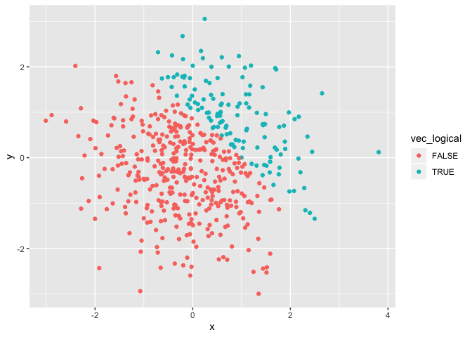
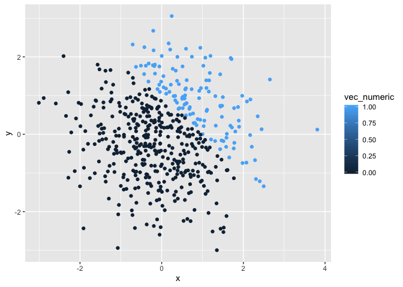
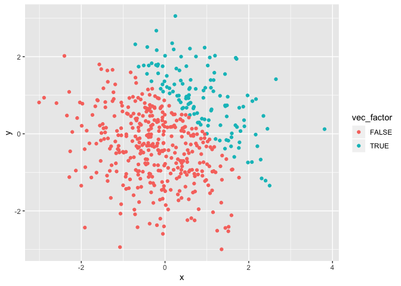

First Homework
================
Anran Shao

# Set up

# Problem 1

## Creating a data frame and getting the mean of each variables

``` r
dataframe1 = tibble(
  vec_numeric = rnorm(8),
  vec_logical = vec_numeric > 0,
  vec_character = c("mouse","pig","dog","cow","rabbit","sheep","bird","penguin"),
  vec_factor = c("pink","white","white","pink","blue","blue","pink","white"),
  )
class(pull(dataframe1,vec_numeric))
```

    ## [1] "numeric"

``` r
class(pull(dataframe1,vec_logical))
```

    ## [1] "logical"

``` r
class(pull(dataframe1,vec_character))
```

    ## [1] "character"

``` r
mean(dataframe1$vec_numeric)
```

    ## [1] 0.2103615

``` r
mean(dataframe1$vec_logical)
```

    ## [1] 0.625

``` r
mean(dataframe1$vec_factor)
```

    ## Warning in mean.default(dataframe1$vec_factor): argument is not numeric or
    ## logical: returning NA

    ## [1] NA

``` r
mean(dataframe1$vec_character)
```

    ## Warning in mean.default(dataframe1$vec_character): argument is not numeric
    ## or logical: returning NA

    ## [1] NA

\*\* The means for numeric variable and logical vector are workable, but
factor and character vectors are not workable because they are not
numeric.

## Multiplication of two variables

``` r
set.seed(1)
logical_num = as.numeric(dataframe1$vec_logical)
logical_fac = as.factor(dataframe1$vec_logical)
logical_fac_num = as.numeric(as.factor(dataframe1$vec_logical))

logical_num  * dataframe1$vec_numeric
logical_fac * dataframe1$vec_numeric
logical_fac_num * dataframe1$vec_numeric
```

# Problem2 – the use of inline R code, plotting, and the behavior of ggplot for variables of different types.

## Creating a data frame

``` r
set.seed(1)

plot_df = tibble(
  x = rnorm(500),
  y = rnorm(500),
  vec_logical = x + y > 1,
  vec_numeric = as.numeric(vec_logical),
  vec_factor = as.factor(vec_logical),
)
```

Short Description: The size of the dataset is 500 and 5. The mean,
median, and the standard deviation of 0.0226441. The proportion of cases
for which 0.252.

## A scatterplot of Y vs X with color points using the logical variable

``` r
ggplot(plot_df, aes(x = x, y = y, color = vec_logical)) + geom_point()
```

<!-- -->

``` r
ggsave("p8105_hw1_as5685.pdf")
```

    ## Saving 7 x 5 in image

logical variable is 0 or 1, so the two colors indicating false or true.

## A scatterplot of Y vs X with color points using the numeric variable

``` r
ggplot(plot_df, aes(x = x, y = y, color = vec_numeric)) + geom_point()
```

<!-- --> The
numeric variable is continuous, so the color scale is continuous and
color is changing from light to dark with the change of value of x and
y.

## A scatterplot of Y vs X with color points using the factor variable

``` r
ggplot(plot_df, aes(x = x, y = y, color = vec_factor)) + geom_point()
```

<!-- -->
factor variable is categorical, so the two colors indicating false or
true.
